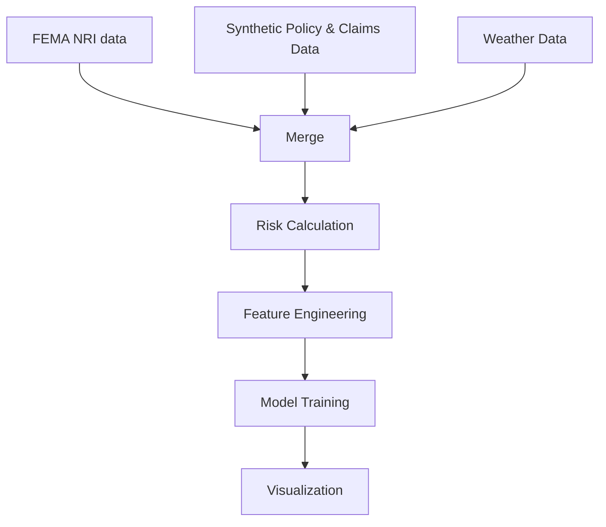

# TerraIQ -A Dynamic-Risk-Scoring-for-Climate-Sensitive-Insurance-Policies

## Overview
This project implements a comprehensive weather risk assessment system for insurance policies. It generates synthetic datasets of policies, claims, and weather data, then builds a machine learning model to predict risk scores based on property characteristics, claims history, and weather patterns.

## Documentation
https://docs.google.com/document/d/1TVukYQasSeuwJV3guuK6-wRrVpoN8iOkxNE_1xMKSSU/edit?usp=sharing
## Features

- Synthetic data generation for policies and claims
- Historical weather data integration from NOAA
- Risk score calculation combining property, weather, and hazard factors
- XGBoost machine learning model for predictions
- Comprehensive EDA and model evaluation

## Data Pipeline


## Installation
### 1. Clone the repository

```bash
git clone https://github.com/yourusername/weather-risk-assessment.git
cd weather-risk-assessment
```

## Usage

- Generate synthetic policy and claims data
- Process weather and hazard data
- Calculate raw and final risk scores
- Handle class imbalance (SMOTE/ADASYN)
- Train an XGBoost regression model
- Output key performance metrics
- Generate risk visualizations

## Data generated

| File Name                                  | Description                              |
| ------------------------------------------ | ---------------------------------------- |
| `policy_Data.csv`                          | Generated policy dataset                 |
| `claims_Data.csv`                          | Generated claims dataset                 |
| `weather_Data.csv`                         | Cleaned and structured weather data      |
| `grand_final_data.csv`                     | Combined dataset for scoring             |
| `balanced_weather_risk_dataset_no_geo.csv` | Final balanced dataset used for modeling |

## Model Training
- An XGBoost Regressor is used with the following configuration:

- model = XGBRegressor(
    objective='reg:squarederror',
    n_estimators=200,
    learning_rate=0.05,
    max_depth=6,
    subsample=0.8,
    colsample_bytree=0.8,
    random_state=42
)
## Model Performance (Test Set)
- R² Score: 0.91
- MAE: 0.04
- RMSE: 0.07
